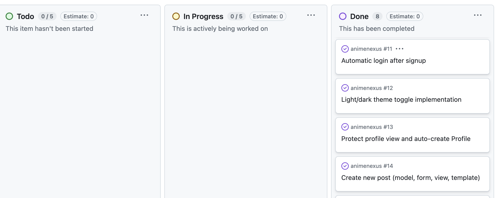
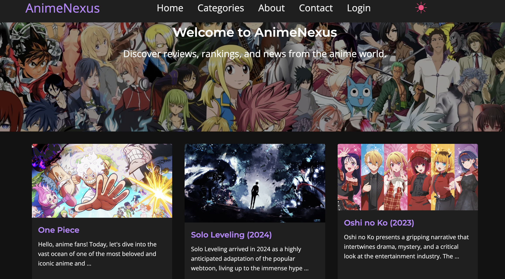
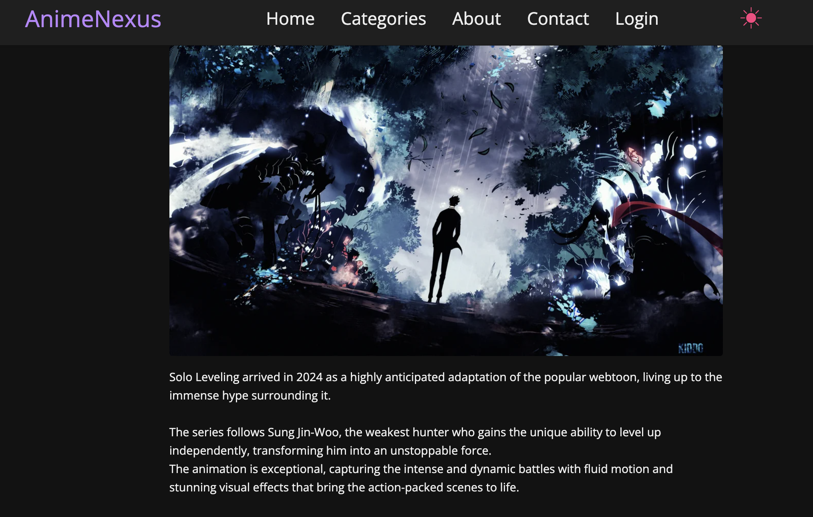
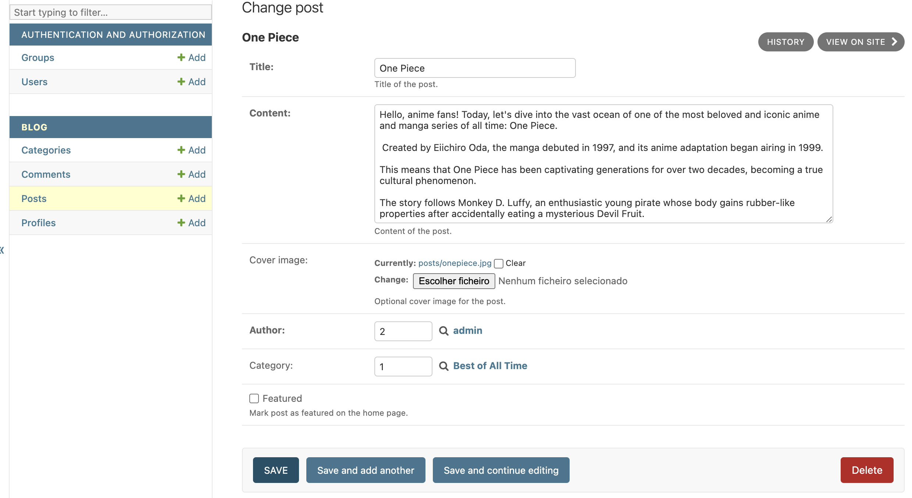

## 1. Agile Process

### 1.1 Epics

1. **Content Management**: Handle creating, editing, viewing, and deleting posts and comments.  
2. **User Management**: Enable user registration, login/logout, profile management, and role-based permissions.  
3. **UI & Theming**: Provide responsive navigation, light/dark mode toggle, and ensure accessibility compliance.  

### 1.2 User Stories & Tasks

#### Epic 1: Content Management
- **US1.1**: As an authenticated user, I want to create a new post with title, content, category, and cover image so that I can share insights.
  **Acceptance Criteria:**  
  - Given I am logged in, when I submit valid post data, then the post is saved and I’m redirected to its detail page with a success message.  
  - Given a required field is missing, when I submit the form, then I see inline validation errors and the post is not created.  
  **Tasks:**
    - Task 1.1.1: Define the `Post` model in `models.py`.
    - Task 1.1.2: Implement `PostForm` with necessary validations in `forms.py`.  
    - Task 1.1.3: Add `create_post` view and corresponding URL.  
    - Task 1.1.4: Develop `post_form.html` template with labeled inputs and error feedback.  

- **US1.2**: As a visitor, I want to browse a paginated list of posts filtered by category so that I can explore topics of interest.  
  - Task 1.2.1: Create `post_list` view with filtering logic.  
  - Task 1.2.2: Build `post_list.html` with a responsive grid.  
  - Task 1.2.3: Design `post_card.html` component to display post previews.  

- **US1.3**: As an author, I want to edit and delete my own posts to maintain content accuracy.  
  - Task 1.3.1: Protect `edit_post` and `delete_post` views with `@login_required`.  
  - Task 1.3.2: Verify ownership before allowing edits or deletions.  
  - Task 1.3.3: Create `post_confirm_delete.html` for confirmation prompt.  

#### Epic 2: User Management
- **US2.1**: As a new user, I want to sign up with email, name, and date of birth so that I can create an account.  
  - Task 2.1.1: Extend `UserCreationForm` to `SignUpForm`.  
  - Task 2.1.2: Develop `signup` view and `signup.html` template.  
  - Task 2.1.3: Implement automatic login after successful registration.  

- **US2.2**: As an authenticated user, I want to log in/out and view my profile so that I can access personalized features.  
  - Task 2.2.1: Configure `LoginView` and `LogoutView` in URLs.  
  - Task 2.2.2: Create `login.html` and `signup.html` templates with clear navigation.  
  - Task 2.2.3: Build `profile` view that auto-creates a `Profile` if missing.  

#### Epic 3: UI & Theming
- **US3.1**: As a mobile user, I want a collapsible menu so I can navigate easily on small screens.  
  - Task 3.1.1: Implement `#nav-toggle` button and `initNavToggle` function in JS.  
  - Task 3.1.2: Style `.nav__list` for mobile via media queries.  

- **US3.2**: As a user, I want to switch between light and dark modes with clear feedback.  
  - Task 3.2.1: Add `#theme-toggle` button with appropriate ARIA labels.  
  - Task 3.2.2: Implement `initThemeToggle` function using `localStorage`.  

### 1.3 Board Mapping

A GitHub Project (or Trello board) tracks all Epics and User Stories through these columns:

- **Backlog**:  
  - All User Stories awaiting prioritization. 

- **To Do**:  
  - Stories planned for the current sprint. 

- **In Progress**:  
  - Stories under active development.  

- **Done**:  
  - Stories fully implemented, tested, and reviewed.

>   

## 2. UX Design

### 2.1 Information Hierarchy

- **Fixed Header**: Always visible at the top with logo and primary navigation (Home, Categories, About, Contact, Login) to ensure consistent access. 
- **Hero Section**: Large, full-width banner on the homepage presenting the site name and a brief tagline to engage visitors immediately.  
- **Responsive Grid Layout**: Post listings displayed in equal-height cards arranged in a fluid grid, allowing users to scan content quickly on all screen sizes.  
- **Post Detail Layout**: Clear separation of title, author metadata, cover image, and body content with ample whitespace for readability.  
- **Comments Section**: Positioned below content with a heading, list of approved comments, and a clearly labeled form for new submissions; inline action buttons for editing/deleting comments on hover/focus.  

### 2.2 Wireframes & Mockups

>   
> 
>  

### 2.3 Design Rationale

- **Accessibility**  
  - Color contrast ratios meet WCAG AA standards.  
  - All interactive elements include aria-label or visible labels.  
  - Keyboard focus styles are prominent and logical.  

- **Responsiveness**  
  - Breakpoints at 768px and 600px ensure navigation and content adapt gracefully to tablets and phones.  
  - Fluid grid and flexible images prevent overflow.  

- **User Feedback**  
  - Success and error messages displayed via Django’s messaging framework, styled for clarity and consistency.  
  - Loading indicators and disabled states for buttons during async operations (e.g., form submission).  

- **Visual Consistency**  
  - CSS variables standardize colors, typography, spacing, and transitions.  
  - Reusable utility classes (`.container`, `.btn`, `.form-group`) enforce uniform styling across components.  
